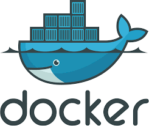

# Docker + Python + Django
> Creation of a simple Django container project. 

Lorem ipsum dolor sit amet, consectetur adipiscing elit. Vestibulum rhoncus, neque eget viverra semper, orci lorem mollis libero, vitae gravida nulla lacus vel quam. Donec et nulla nisi. Donec non fringilla metus. Sed ultricies laoreet est in consectetur. 

Suspendisse sem sapien, commodo et lorem aliquet, consequat consectetur risus. Maecenas ac interdum purus. Vestibulum et massa nec mi consectetur facilisis ultrices vel elit. Morbi vehicula mi nunc, id ultricies dolor volutpat et. 

 # +  

## Instalation

```
docker run ######
docker exec ##### python3 /home/fusion/manage.py runserver
```

# Case of Use

None, actualy.

Applying a course exercise but with the latest version of each app used to lear how to solve with conflict issues.

## Dev Enviroment

1 - pip install -r freeze.txt

## Releases

* 0.X.X
    * CHANGE: Lorem ipsum dolor sit amet, consectetur adipiscing elit.
* 0.X.X
    * CHANGE: Lorem ipsum dolor sit amet, consectetur adipiscing elit.
    * ADD: Lorem ipsum dolor sit amet, consectetur adipiscing elit.`
* 0.X.X
    * FIX: Lorem ipsum dolor sit amet, consectetur adipiscing elit.
* 0.X.X
    * Lorem ipsum dolor sit amet, consectetur adipiscing elit.
    * Lorem ipsum dolor sit amet, consectetur adipiscing elit.
* 0.0.1
    * This repository with the README.md file

## Meta

Ricard Roberg - [@SeuTwitter](https://twitter.com/SeuTwitter) - seuemail@gmail.com

Ddistributed under licence gpl. Veja [GPL](https://en.wikipedia.org/wiki/GNU_General_Public_License) for more informations.

[https://github.com/ricardroberg/fusio_with_docker](https://github.com)
